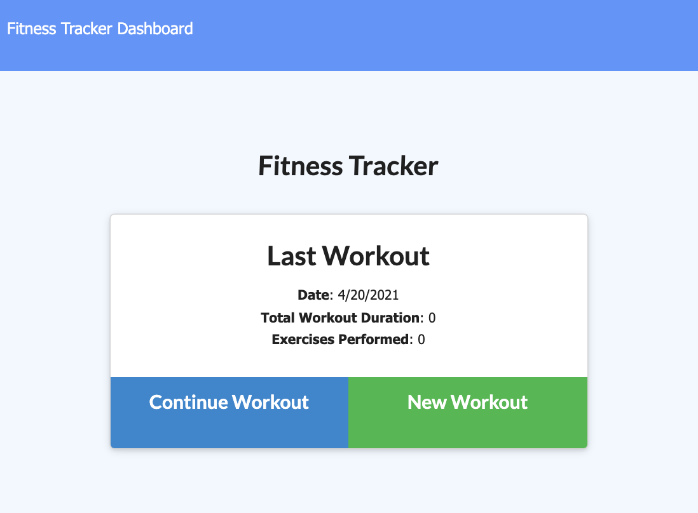

# Fitness-Tracker

## Table of Contents
* [Technology Used](#technology-used)
* [Deployed Fitness App ](#deployed-fitness-app)
* [Screenshot](#screenshot)

## Deployed Fitness App 
[Fitness Tracker](https://uofa-fitness-tracker.herokuapp.com/?id=607f05e63794ee0015126728)
 

## Screenshot

 

## Description

Here is a simple to use Fitness Tracker created using a NoSQL server. Add exercises to the most recent workout plan, add new exercises to a new workout plan, view the combined weight of multiple exercises, and view the total duration of each workout from the past seven workouts on the dashboard page. 

## Technology Used
* HTML
* CSS
* JavaScript
* Express.js
* Mongoose 
* MongoDB Atlas
* Heroku

 

## Questions
If you have any questions about this project, please reach out!
Email: drowekorte@gmail.com
 
Github: [@drowekorte](https://github.com/Drowekorte)

